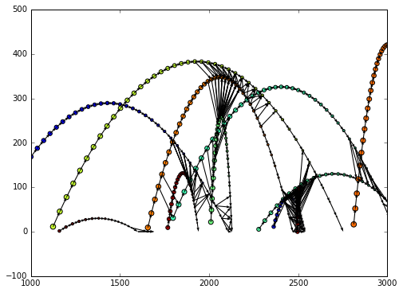

10 Minutes to DeepGraph
=======================

[:download:`ipython notebook <10min_to_deepgraph.ipynb>`] [:download:`python script <10min_to_deepgraph.py>`]

This is a short introduction to DeepGraph. In the following, we
demonstrate DeepGraph's core functionalities by a toy data-set, "flying
balls".

First of all, we need to import some packages

.. code:: python

    # for plots
    %matplotlib inline
    import matplotlib.pyplot as plt
    plt.rcParams['figure.figsize'] = 8, 6
    
    # the usual
    import numpy as np
    import pandas as pd
    
    import deepgraph as dg

**Loading Toy Data**

Then, we need data in the form of a pandas `DataFrame <http://pandas.pydata.org/pandas-docs/stable/generated/pandas.DataFrame.html>`_, representing the nodes of our graph

.. code:: python

    v = pd.read_pickle('flying_balls.pickle')
    print(v.head())

.. parsed-literal::

       time       x    y  ball_id
    0     0  1692.0  0.0        0
    1     0  8681.0  0.0        1
    2     0   490.0  0.0        2
    3     0  7439.0  0.0        3
    4     0  4998.0  0.0        4

The data consists of

.. code:: python

    print(len(v))

.. parsed-literal::

    1168

space-time measurements of 50 different toy balls in two-dimensional
space. Each space-time measurement (i.e. row of ``v``) represents a
**node**.

Let's plot the data such that each ball has it's own color

.. code:: python

    plt.scatter(v.x, v.y, s=v.time, c=v.ball_id)

.. parsed-literal::

    <matplotlib.collections.PathCollection at 0x7fb1ced5bc18>

.. image:: 10min_to_deepgraph_files/10min_to_deepgraph_10_1.png

Creating Edges
--------------

In order to create edges between these nodes, we now initiate a :py:class:`dg.DeepGraph <.DeepGraph>` instance

.. code:: python

    g = dg.DeepGraph(v)
    g

.. parsed-literal::

    <DeepGraph object, with n=1168 node(s) and m=0 edge(s) at 0x7fb1cf1e1b38>

and use it to create edges between the nodes given by :py:attr:`g.v <.DeepGraph.v>`. For that matter, we may define a **connector** function

.. code:: python

    def x_dist(x_s, x_t):
        dx = x_t - x_s
        return dx

and pass it to :py:meth:`g.create_edges <.create_edges>` in order to compute the distance in the x-coordinate of each pair of nodes

.. code:: python

    g.create_edges(connectors=x_dist)
    g

.. parsed-literal::

    <DeepGraph object, with n=1168 node(s) and m=681528 edge(s) at 0x7fb1cf1e1b38>

.. code:: python

    print(g.e.head())

.. parsed-literal::

             dx
    s t        
    0 1  6989.0
      2 -1202.0
      3  5747.0
      4  3306.0
      5  2812.0

Let's say we're only interested in creating edges between nodes with a
x-distance smaller than 1000. Then we may additionally define a
**selector**

.. code:: python

    def x_dist_selector(dx, sources, targets):
        dxa = np.abs(dx)
        sources = sources[dxa <= 1000]
        targets = targets[dxa <= 1000]
        return sources, targets

and pass both the **connector** and **selector** to :py:meth:`g.create_edges <.create_edges>`

.. code:: python

    g.create_edges(connectors=x_dist, selectors=x_dist_selector)
    g

.. parsed-literal::

    <DeepGraph object, with n=1168 node(s) and m=156938 edge(s) at 0x7fb1cf1e1b38>

.. code:: python

    print(g.e.head())

.. parsed-literal::

             dx
    s t        
    0 6   416.0
      7   848.0
      19 -973.0
      24  437.0
      38  778.0

There is, however, a much more efficient way of creating edges that
involve a simple distance threshold such as the one above

Creating Edges on a FastTrack
-----------------------------

In order to efficiently create edges including a selection of edges via a simple distance threshold as above, one should use the :py:meth:`create_edges_ft <.create_edges_ft>` method. It relies on a sorted DataFrame, so we need to sort :py:attr:`g.v <.DeepGraph.v>` first

.. code:: python

    g.v.sort_values('x', inplace=True)

.. code:: python

    g.create_edges_ft(ft_feature=('x', 1000))
    g

.. parsed-literal::

    <DeepGraph object, with n=1168 node(s) and m=156938 edge(s) at 0x7fb1cf1e1b38>

Let's compare the efficiency

.. code:: python

    %timeit -n3 -r3 g.create_edges(connectors=x_dist, selectors=x_dist_selector)

.. parsed-literal::

    3 loops, best of 3: 681 ms per loop

.. code:: python

    %timeit -n3 -r3 g.create_edges_ft(ft_feature=('x', 1000))

.. parsed-literal::

    3 loops, best of 3: 244 ms per loop

The :py:meth:`create_edges_ft <.create_edges_ft>` method also accepts **connectors** and **selectors** as input. Let's connect only those measurements that are close in space and time 

.. code:: python

    def y_dist(y_s, y_t):
        dy = y_t - y_s
        return dy
    
    def time_dist(time_t, time_s):
        dt = time_t - time_s
        return dt
    
    def y_dist_selector(dy, sources, targets):
        dya = np.abs(dy)
        sources = sources[dya <= 100]
        targets = targets[dya <= 100]
        return sources, targets
    
    def time_dist_selector(dt, sources, targets):
        dta = np.abs(dt)
        sources = sources[dta <= 1]
        targets = targets[dta <= 1]
        return sources, targets

.. code:: python

    g.create_edges_ft(ft_feature=('x', 100),
                      connectors=[y_dist, time_dist],
                      selectors=[y_dist_selector, time_dist_selector])
    g

.. parsed-literal::

    <DeepGraph object, with n=1168 node(s) and m=1899 edge(s) at 0x7fb1cf1e1b38>

.. code:: python

    print(g.e.head())

.. parsed-literal::

             dt         dy       ft_r
    s   t                            
    890 867  -1  19.311136  33.415831
    867 843  -1  17.678482  33.415831
    843 818  -1  16.045829  33.415831
    818 792  -1  14.413176  33.415831
    792 766  -1  12.780523  33.415831

We can now plot the flying balls and the edges we just created with the :py:meth:`plot_2d <.plot_2d>` method

.. code:: python

    obj = g.plot_2d('x', 'y', edges=True, kwds_scatter={'c': g.v.ball_id, 's': g.v.time})
    obj['ax'].set_xlim(1000,3000)

.. parsed-literal::

    (1000, 3000)

Graph Partitioning
------------------

The :py:class:`DeepGraph <.DeepGraph>` class also offers methods to partition :py:meth:`nodes <.partition_nodes>`, :py:meth:`edges <.partition_edges>` and an entire :py:meth:`graph <.partition_graph>`. See the docstrings and the :ref:`other tutorial <tutorial_pcp>` for details and examples.

Graph Interfaces
----------------

Furthermore, you may inspect the docstrings of :py:meth:`return_cs_graph <.return_cs_graph>`, :py:meth:`return_nx_graph <.return_nx_graph>` and :py:meth:`return_gt_graph <.return_gt_graph>` to see how to convert from DeepGraph's DataFrame representation of a network to sparse adjacency matrices, NetworkX's network representation and graph_tool's network representation.

Plotting Methods
----------------

DeepGraph also offers a number of useful Plotting methods. See :ref:`plotting methods <plotting_methods>` for details and inspect the corresponding docstrings for examples.
