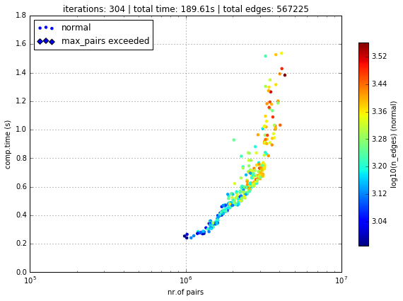
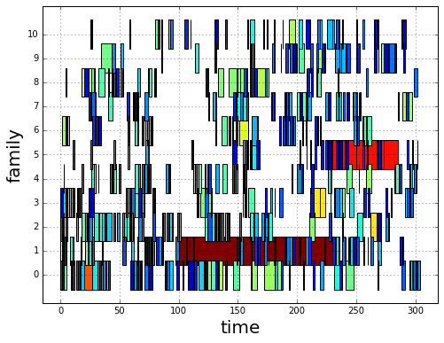
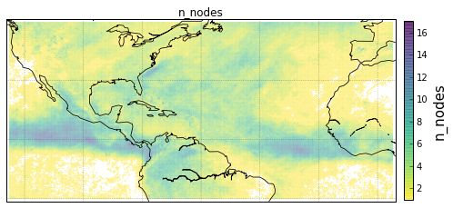
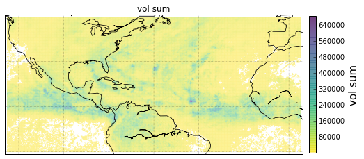
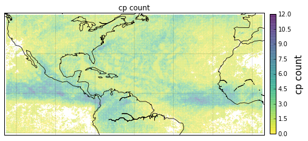
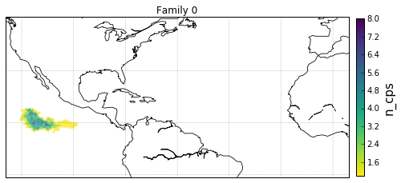
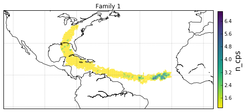
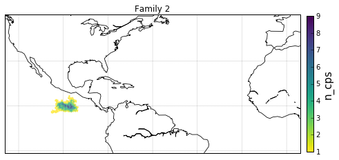
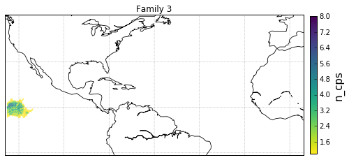
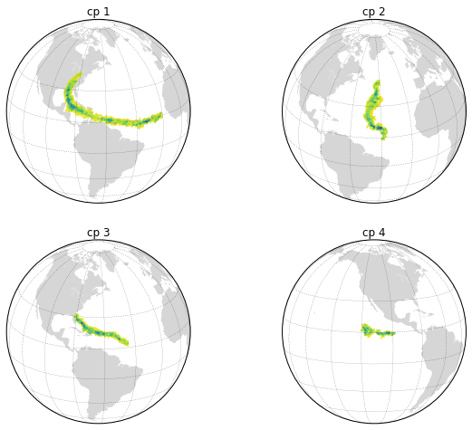

.. _tutorial_pcp:

Building a DeepGraph of Extreme Precipitation
=============================================

[:download:`ipython notebook <precipitation.ipynb>`] [:download:`python script <precipitation.py>`] [:download:`data <SSW_download_2016-05-03T20_19_28_23621_2oIe06xp.inp>`]

In the following we build a deep graph of a high-resolution dataset of
precipitation measurements.

The goal is to first detect spatiotemporal clusters of extreme
precipitation events and then to create families of these clusters based
on a spatial correlation measure. Finally, we create and plot some
informative (intersection) partitions of the deep graph.

For further details see section V of the original paper:
https://arxiv.org/abs/1604.00971

First of all, we need to import some packages

.. code:: python

    # data i/o
    import os
    import xarray

    # for plots
    import matplotlib.pyplot as plt

    # the usual
    import numpy as np
    import pandas as pd

    import deepgraph as dg

    # notebook display
    from IPython.display import HTML
    %matplotlib inline
    plt.rcParams['figure.figsize'] = 8, 6
    pd.options.display.max_rows = 10
    pd.set_option('expand_frame_repr', False)

Selecting and Preprocessing the Precipitation Data
--------------------------------------------------

Selection
~~~~~~~~~

If you want to select your own spatiotemporal box of precipitation
events, you may follow the instructions below and change the filename in
the next box of code.

-  Go to
   https://disc.gsfc.nasa.gov/datasets/TRMM\_3B42\_V7/summary?keywords=TRMM\_3B42\_V7
-  click on "Simple Subset Wizard"
-  select the "Date Range" (and if desired a "Spatial Bounding Box")
   you're interested in
-  click on "Search for Data Sets"
-  expand the list by clicking on the "+" symbol
-  mark the check box "precipitation"
-  (optional, but recommended) click on the selector to change from
   "netCDF" to "gzipped netCDF"
-  click on "Subset Selected Data Sets"
-  click on "View Subset Results"
-  right click on the "Get list of URLs for this subset in a file" link,
   and choose "Save Link As..."
-  the downloaded file will have a name similar to
   "SSW\_download\_2016-05-03T20\_19\_28\_23621\_2oIe06xp.inp". Note
   which directory the downloaded file is saved to, and in your Unix
   shell, set your current working directory to that directory.
-  get the files via

.. code:: python

    os.system("wget --content-disposition --directory-prefix=tmp --load-cookies ~/.urs_cookies --save-cookies ~/.urs_cookies --auth-no-challenge=on --keep-session-cookies -i SSW_download_2016-05-03T20_19_28_23621_2oIe06xp.inp")

Preprocessing
~~~~~~~~~~~~~

Next, we need to convert the downloaded netCDF files to a pandas `DataFrame <http://pandas.pydata.org/pandas-docs/stable/generated/pandas.DataFrame.html>`_, which we can then use to initiate a :py:class:`dg.DeepGraph <.DeepGraph>`

.. code:: python

    # choose "wet times" threshold
    r = .1
    # choose "extreme" precipitation threshold
    p = .9

    v_list = []
    for file in os.listdir('tmp'):
        if file.startswith('3B42.'):

            # open the downloaded netCDF file
            # unfortunately, we have to decode times ourselves, since
            # the format of the downloaded files doesn't work
            # see also: https://github.com/pydata/xarray/issues/521
            f = xarray.open_dataset('tmp/{}'.format(file), decode_times=False)

            # create integer-based (x,y) coordinates
            f['x'] = (('longitude'), np.arange(len(f.longitude)))
            f['y'] = (('latitude'), np.arange(len(f.latitude)))

            # convert to pd.DataFrame
            vt = f.to_dataframe()

            # we only consider "wet times", pcp >= 0.1mm/h
            vt = vt[vt.pcp >= r]

            # reset index
            vt.reset_index(inplace=True)

            # add correct times
            ftime = f.time.units.split()[2:]
            year, month, day = ftime[0].split('-')
            hour = ftime[1]
            time = pd.datetime(int(year), int(month), int(day), int(hour))
            vt['time'] = time

            # compute "area" for each event
            vt['area'] = 111**2 * .25**2 * np.cos(2*np.pi*vt.latitude / 360.)

            # compute "volume of water precipitated" for each event
            vt['vol'] = vt.pcp * 3 * vt.area

            # set dtypes -> economize ram
            vt['pcp'] = vt['pcp'] * 100
            vt['pcp'] = vt['pcp'].astype(np.uint16)
            vt['latitude'] = vt['latitude'].astype(np.float16)
            vt['longitude'] = vt['longitude'].astype(np.float16)
            vt['area'] = vt['area'].astype(np.uint16)
            vt['vol'] = vt['vol'].astype(np.uint32)
            vt['x'] = vt['x'].astype(np.uint16)
            vt['y'] = vt['y'].astype(np.uint16)

            # append to list
            v_list.append(vt)
            f.close()

    # concatenate the DataFrames
    v = pd.concat(v_list)

    # append a column indicating geographical locations (i.e., supernode labels)
    v['g_id'] = v.groupby(['longitude', 'latitude']).grouper.group_info[0]
    v['g_id'] = v['g_id'].astype(np.uint32)

    # select `p`th percentile of precipitation events for each geographical location
    v = v.groupby('g_id').apply(lambda x: x[x.pcp >= x.pcp.quantile(p)])

    # append integer-based time
    dtimes = pd.date_range(v.time.min(), v.time.max(), freq='3H')
    dtdic = {dtime: itime for itime, dtime in enumerate(dtimes)}
    v['itime'] = v.time.apply(lambda x: dtdic[x])
    v['itime'] = v['itime'].astype(np.uint16)

    # sort by time
    v.sort_values('time', inplace=True)

    # set unique node index
    v.set_index(np.arange(len(v)), inplace=True)

    # shorten column names
    v.rename(columns={'pcp': 'r',
                      'latitude': 'lat',
                      'longitude': 'lon',
                      'time': 'dtime',
                      'itime': 'time'},
             inplace=True)

The created `DataFrame <http://pandas.pydata.org/pandas-docs/stable/generated/pandas.DataFrame.html>`_ of extreme precipitation measurements looks like this

.. code:: python

    print(v)

.. parsed-literal::

               lat      lon      dtime     r    x    y  area    vol   g_id  time
    0       15.125 -118.125 2004-08-20  1084   28  101   743  24174   5652     0
    1       44.875  -30.625 2004-08-20   392  378  220   545   6433  85341     0
    2       45.125  -30.625 2004-08-20   454  378  221   543   7416  85342     0
    3       45.375  -30.625 2004-08-20   909  378  222   540  14767  85343     0
    4       45.625  -30.625 2004-08-20   907  378  223   538  14669  85344     0
    ...        ...      ...        ...   ...  ...  ...   ...    ...    ...   ...
    382306  26.875  -46.625 2004-09-27   503  314  148   686  10385  70380   304
    382307  38.375  -37.125 2004-09-27   453  352  194   603   8222  79095   304
    382308   8.125 -105.125 2004-09-27   509   80   73   762  11663  17007   304
    382309  21.875  -42.875 2004-09-27   260  329  128   714   5595  73875   304
    382310   6.625 -111.125 2004-09-27   192   56   67   764   4428  11790   304

    [382311 rows x 10 columns]

We identify each row of this table as a node of our :py:class:`DeepGraph <.DeepGraph>`

.. code:: python

    g = dg.DeepGraph(v)

Plot the Data
~~~~~~~~~~~~~

Let's take a look at the data by creating a video of the time-evolution of precipitation measurements. Using the :py:meth:`plot_map_generator <.plot_map_generator>` method, this is straight forward.

.. code:: python

    # configure map projection
    kwds_basemap = {'llcrnrlon': v.lon.min() - 1,
                    'urcrnrlon': v.lon.max() + 1,
                    'llcrnrlat': v.lat.min() - 1,
                    'urcrnrlat': v.lat.max() + 1,
                    'resolution': 'i'}

    # configure scatter plots
    kwds_scatter = {'s': 1.5,
                    'c': g.v.r.values / 100.,
                    'edgecolors': 'none',
                    'cmap': 'viridis_r'}

    # create generator of scatter plots on map
    objs = g.plot_map_generator('lon', 'lat', 'dtime',
                                kwds_basemap=kwds_basemap,
                                kwds_scatter=kwds_scatter)

    # plot and store frames
    for i, obj in enumerate(objs):

        # configure plots
        cb = obj['fig'].colorbar(obj['pc'], fraction=0.025, pad=0.01)
        cb.set_label('[mm/h]')
        obj['m'].fillcontinents(color='0.2', zorder=0, alpha=.4)
        obj['ax'].set_title('{}'.format(obj['group']))

        # store and close
        obj['fig'].savefig('tmp/pcp_{:03d}.png'.format(i),
                           dpi=300, bbox_inches='tight')
        plt.close(obj['fig'])

.. code:: python

    # create video with ffmpeg
    cmd = "ffmpeg -y -r 5 -i tmp/pcp_%03d.png -c:v libx264 -r 20 -vf scale=2052:1004 {}.mp4"
    os.system(cmd.format('precipitation_files/pcp'))

.. code:: python

    # embed video
    HTML("""
    <video width="700" height="350" controls>
      <source src="precipitation_files/pcp.mp4" type="video/mp4">
    </video>
    """)

.. raw:: html

    <video width="700" height="350" controls>
      <source src="http://deepgraph.readthedocs.io/en/latest/_downloads/pcp.mp4" type="video/mp4">
    </video>

[:download:`download video <precipitation_files/pcp.mp4>`]

Detecting SpatioTemporal Clusters of Extreme Precipitation
----------------------------------------------------------

In this tutorial, we're interested in local formations of spatiotemporal
clusters of extreme precipitation events. For that matter, we now use
DeepGraph to identify such clusters and track their temporal evolution.

Create Edges
~~~~~~~~~~~~

We now use DeepGraph to create edges between the nodes given by ``g.v``.

The edges of ``g`` will be utilized to detect spatiotemporal clusters in
the data, or in more technical terms: to partition the set of all nodes
into subsets of connected grid points. One can imagine the nodes to be
elements of a :math:`3` dimensional grid box (x,y,time), where we allow
every node to have :math:`26` possible neighbours (:math:`8` neighbours
in the time slice of the measurement, :math:`t_i`, and :math:`9`
neighbours in each the time slice :math:`t_i − 1` and :math:`t_i + 1`).

For that matter, we pass the following **connectors**

.. code:: python

    def grid_2d_dx(x_s, x_t):
        dx = x_t - x_s
        return dx

    def grid_2d_dy(y_s, y_t):
        dy = y_t - y_s
        return dy

and **selectors**

.. code:: python

    def s_grid_2d_dx(dx, sources, targets):
        dxa = np.abs(dx)
        sources = sources[dxa <= 1]
        targets = targets[dxa <= 1]
        return sources, targets

    def s_grid_2d_dy(dy, sources, targets):
        dya = np.abs(dy)
        sources = sources[dya <= 1]
        targets = targets[dya <= 1]
        return sources, targets

to the :py:meth:`create_edges_ft <.create_edges_ft>` method

.. code:: python

    g.create_edges_ft(ft_feature=('time', 1),
                      connectors=[grid_2d_dx, grid_2d_dy],
                      selectors=[s_grid_2d_dx, s_grid_2d_dy],
                      r_dtype_dic={'ft_r': np.bool,
                                   'dx': np.int8,
                                   'dy': np.int8},
                      logfile='create_e',
                      max_pairs=1e7)

    # rename fast track relation
    g.e.rename(columns={'ft_r': 'dt'}, inplace=True)

To see how many nodes and edges our graph's comprised of, one may simply
type

.. code:: python

    g

.. parsed-literal::

    <DeepGraph object, with n=382311 node(s) and m=567225 edge(s) at 0x7f7a4c3de160>

The edges we just created look like this

.. code:: python

    print(g.e)

.. parsed-literal::

                   dx  dy     dt
    s      t
    0      1362     0   1  False
           1432     1   0  False
           1433     1   1  False
           1696     1   0   True
           1699     1   1   True
    ...            ..  ..    ...
    382284 382291   0   1  False
    382295 382296   0   1  False
    382296 382299   0   1  False
    382299 382309   0   1  False
    382304 382306   0   1  False

    [567225 rows x 3 columns]

**Logfile Plot**

To see how long it took to create the edges, one may use the :py:meth:`plot_logfile <.plot_logfile>` method

.. code:: python

    g.plot_logfile('create_e')

Find the Connected Components
~~~~~~~~~~~~~~~~~~~~~~~~~~~~~

Having linked all neighbouring nodes, the spatiotemporal clusters can be identified as the connected components of the graph. For practical reasons, :py:class:`DeepGraph <.DeepGraph>` directly implements a method to find the connected components of a graph, :py:meth:`append_cp <.append_cp>`

.. code:: python

    # all singular components (components comprised of one node only)
    # are consolidated under the label 0
    g.append_cp(consolidate_singles=True)
    # we don't need the edges any more
    del g.e

the node table now has a component membership column appended

.. code:: python

    print(g.v)

.. parsed-literal::

               lat      lon      dtime     r    x    y  area    vol   g_id  time     cp
    0       15.125 -118.125 2004-08-20  1084   28  101   743  24174   5652     0    865
    1       44.875  -30.625 2004-08-20   392  378  220   545   6433  85341     0   5079
    2       45.125  -30.625 2004-08-20   454  378  221   543   7416  85342     0   5079
    3       45.375  -30.625 2004-08-20   909  378  222   540  14767  85343     0   5079
    4       45.625  -30.625 2004-08-20   907  378  223   538  14669  85344     0   5079
    ...        ...      ...        ...   ...  ...  ...   ...    ...    ...   ...    ...
    382306  26.875  -46.625 2004-09-27   503  314  148   686  10385  70380   304    609
    382307  38.375  -37.125 2004-09-27   453  352  194   603   8222  79095   304      0
    382308   8.125 -105.125 2004-09-27   509   80   73   762  11663  17007   304    174
    382309  21.875  -42.875 2004-09-27   260  329  128   714   5595  73875   304      8
    382310   6.625 -111.125 2004-09-27   192   56   67   764   4428  11790   304  15610

    [382311 rows x 11 columns]

Let's see how many spatiotemporal clusters ``g`` is comprised of
(discarding singular components)

.. code:: python

    g.v.cp.max()

.. parsed-literal::

    33169

and how many nodes there are in the components

.. code:: python

    print(g.v.cp.value_counts())

.. parsed-literal::

    0        64678
    1        16460
    2         8519
    3         6381
    4         3403
             ...
    29601        2
    27554        2
    25507        2
    23460        2
    20159        2
    Name: cp, dtype: int64

Partition the Nodes Into a Component Supernode Table
~~~~~~~~~~~~~~~~~~~~~~~~~~~~~~~~~~~~~~~~~~~~~~~~~~~~

In order to aggregate and compute some information about the precipitiation clusters, we now partition the nodes by the type of feature ``cp``, the component membership labels of the nodes just created. This can be done with the :py:meth:`partition_nodes <.partition_nodes>` method

.. code:: python

    # feature functions, will be applied to each component of g
    feature_funcs = {'dtime': [np.min, np.max],
                     'time': [np.min, np.max],
                     'vol': [np.sum],
                     'lat': [np.mean],
                     'lon': [np.mean]}

    # partition the node table
    cpv, gv = g.partition_nodes('cp', feature_funcs, return_gv=True)

    # append geographical id sets
    cpv['g_ids'] = gv['g_id'].apply(set)

    # append cardinality of g_id sets
    cpv['n_unique_g_ids'] = cpv['g_ids'].apply(len)

    # append time spans
    cpv['dt'] = cpv['dtime_amax'] - cpv['dtime_amin']

    # append spatial coverage
    def area(group):
        return group.drop_duplicates('g_id').area.sum()
    cpv['area'] = gv.apply(area)

The clusters look like this

.. code:: python

    print(cpv)

.. parsed-literal::

           n_nodes          dtime_amin          dtime_amax  time_amin  time_amax   lat_mean    vol_sum   lon_mean                                              g_ids  n_unique_g_ids               dt      area
    cp
    0        64678 2004-08-20 00:00:00 2004-09-27 00:00:00          0        304  17.609375  627097323  -63.40625  {0, 1, 2, 6, 7, 10, 12, 13, 14, 22, 23, 24, 25...           49808 38 days 00:00:00  34781178
    1        16460 2004-09-01 06:00:00 2004-09-17 18:00:00         98        230  17.281250  351187150  -65.12500  {65536, 65537, 65538, 65539, 65540, 65541, 655...            6629 16 days 12:00:00   4803624
    2         8519 2004-09-17 03:00:00 2004-09-24 15:00:00        225        285  26.906250  133698579  -44.62500  {73728, 73729, 73730, 73731, 73732, 73733, 737...            3730  7 days 12:00:00   2507350
    3         6381 2004-08-26 09:00:00 2004-09-06 03:00:00         51        137  21.062500  113782748  -64.12500  {65555, 65556, 65557, 65558, 65559, 65560, 655...            2442 10 days 18:00:00   1749673
    4         3403 2004-08-21 21:00:00 2004-08-24 12:00:00         15         36  10.578125   66675326 -111.93750  {8141, 14654, 11805, 16363, 8142, 11806, 20490...            1294  2 days 15:00:00    978604
    ...        ...                 ...                 ...        ...        ...        ...        ...        ...                                                ...             ...              ...       ...
    33165        2 2004-08-23 18:00:00 2004-08-23 18:00:00         30         30  15.500000      20212 -103.87500                                     {18115, 18116}               2  0 days 00:00:00      1483
    33166        2 2004-09-05 18:00:00 2004-09-05 18:00:00        134        134  27.250000       9366 -121.87500                                       {2688, 2687}               2  0 days 00:00:00      1368
    33167        2 2004-08-30 15:00:00 2004-08-30 15:00:00         85         85   9.250000      43096    0.62500                                   {112116, 112117}               2  0 days 00:00:00      1519
    33168        2 2004-09-09 03:00:00 2004-09-09 03:00:00        161        161   6.750000      24156  -13.62500                                   {100613, 100614}               2  0 days 00:00:00      1528
    33169        2 2004-09-11 03:00:00 2004-09-11 03:00:00        177        177  15.500000      46798  -16.12500                                     {98523, 98524}               2  0 days 00:00:00      1483

    [33170 rows x 12 columns]

Plot the Largest Component
~~~~~~~~~~~~~~~~~~~~~~~~~~

Let's see how the largest cluster of extreme precipitation evolves over time, again using the :py:meth:`plot_map_generator <.plot_map_generator>` method

.. code:: python

    # temporary DeepGraph instance containing
    # only the largest component
    gt = dg.DeepGraph(g.v)
    gt.filter_by_values_v('cp', 1)

    # configure map projection
    from mpl_toolkits.basemap import Basemap
    m1 = Basemap(projection='ortho',
                 lon_0=cpv.loc[1].lon_mean + 12,
                 lat_0=cpv.loc[1].lat_mean + 8,
                 resolution=None)
    width = (m1.urcrnrx - m1.llcrnrx) * .65
    height = (m1.urcrnry - m1.llcrnry) * .45

    kwds_basemap = {'projection': 'ortho',
                    'lon_0': cpv.loc[1].lon_mean + 12,
                    'lat_0': cpv.loc[1].lat_mean + 8,
                    'llcrnrx': -0.5 * width,
                    'llcrnry': -0.5 * height,
                    'urcrnrx': 0.5 * width,
                    'urcrnry': 0.5 * height,
                    'resolution': 'i'}

    # configure scatter plots
    kwds_scatter = {'s': 2,
                    'c': np.log(gt.v.r.values / 100.),
                    'edgecolors': 'none',
                    'cmap': 'viridis_r'}

    # create generator of scatter plots on map
    objs = gt.plot_map_generator('lon', 'lat', 'dtime',
                                  kwds_basemap=kwds_basemap,
                                  kwds_scatter=kwds_scatter)

    # plot and store frames
    for i, obj in enumerate(objs):

        # configure plots
        obj['m'].fillcontinents(color='0.2', zorder=0, alpha=.4)
        obj['m'].drawparallels(range(-50, 50, 20), linewidth=.2)
        obj['m'].drawmeridians(range(0, 360, 20), linewidth=.2)
        obj['ax'].set_title('{}'.format(obj['group']))

        # store and close
        obj['fig'].savefig('tmp/cp1_ortho_{:03d}.png'.format(i),
                           dpi=300, bbox_inches='tight')
        plt.close(obj['fig'])

.. code:: python

    # create video with ffmpeg
    cmd = "ffmpeg -y -r 5 -i tmp/cp1_ortho_%03d.png -c:v libx264 -r 20 -vf scale=1919:1406 {}.mp4"
    os.system(cmd.format('precipitation_files/cp1_ortho'))

.. code:: python

    # embed video
    HTML("""
    <video width="700" height="500" controls>
      <source src="precipitation_files/cp1_ortho.mp4" type="video/mp4">
    </video>
    """)

.. raw:: html

    <video width="700" height="500" controls>
      <source src="http://deepgraph.readthedocs.io/en/latest/_downloads/cp1_ortho.mp4" type="video/mp4">
    </video>

[:download:`download video <precipitation_files/cp1_ortho.mp4>`]

Detecting Families of Spatially Related Clusters
------------------------------------------------

Create SuperEdges between the Components
~~~~~~~~~~~~~~~~~~~~~~~~~~~~~~~~~~~~~~~~

We now create superedges between the spatiotemporal clusters in order to
find families of clusters that have a strong regional overlap. Passing
the following **connectors** and **selector**

.. code:: python

    # compute intersection of geographical locations
    def cp_node_intersection(g_ids_s, g_ids_t):
        intsec = np.zeros(len(g_ids_s), dtype=object)
        intsec_card = np.zeros(len(g_ids_s), dtype=np.int)
        for i in range(len(g_ids_s)):
            intsec[i] = g_ids_s[i].intersection(g_ids_t[i])
            intsec_card[i] = len(intsec[i])
        return intsec_card

    # compute a spatial overlap measure between clusters
    def cp_intersection_strength(n_unique_g_ids_s, n_unique_g_ids_t, intsec_card):
        min_card = np.array(np.vstack((n_unique_g_ids_s, n_unique_g_ids_t)).min(axis=0),
                            dtype=np.float64)
        intsec_strength = intsec_card / min_card
        return intsec_strength

    # compute temporal distance between clusters
    def time_dist(dtime_amin_s, dtime_amin_t):
        dt = dtime_amin_t - dtime_amin_s
        return dt

to the :py:meth:`create_edges <.create_edges>` method will provide the information necessary for this task

.. code:: python

    # discard singular components
    cpv.drop(0, inplace=True)

    # we only consider the largest 5000 clusters
    cpv = cpv.iloc[:5000]

    # initiate DeepGraph
    cpg = dg.DeepGraph(cpv)

    # create edges
    cpg.create_edges(connectors=[cp_node_intersection,
                                 cp_intersection_strength],
                     no_transfer_rs=['intsec_card'],
                     logfile='create_cpe',
                     step_size=1e7)

Since no selection of edges has taken place, the number of edges should
be ``cpg.n``\ \*(\ ``cpg.n``-1)/2

.. code:: python

    cpg

.. parsed-literal::

    <DeepGraph object, with n=5000 node(s) and m=12497500 edge(s) at 0x7f7a00aec128>

.. code:: python

    print(cpg.e)

.. parsed-literal::

               intsec_strength
    s    t
    1    2            0.018499
         3            0.002457
         4            0.000000
         5            0.000000
         6            0.000000
    ...                    ...
    4997 4999         0.000000
         5000         0.000000
    4998 4999         0.000000
         5000         0.000000
    4999 5000         0.000000

    [12497500 rows x 1 columns]

.. code:: python

    print(cpg.e.intsec_strength.value_counts())

.. parsed-literal::

    0.000000    12481941
    1.000000         787
    0.111111         488
    0.333333         481
    0.500000         462
                  ...
    0.012346           1
    0.158537           1
    0.178082           1
    0.658537           1
    0.018809           1
    Name: intsec_strength, dtype: int64

Hierarchically Agglomerate Clusters into Families
~~~~~~~~~~~~~~~~~~~~~~~~~~~~~~~~~~~~~~~~~~~~~~~~~

Based on the above measure of spatial overlap between clusters, we now
perform an agglomerative, hierarchical clustering of the spatio-temporal
clusters into regionally coherent families.

.. code:: python

    from scipy.cluster.hierarchy import linkage, fcluster

    # create condensed distance matrix
    dv = 1 - cpg.e.intsec_strength.values
    del cpg.e

    # create linkage matrix
    lm = linkage(dv, method='average', metric='euclidean')
    del dv

    # form flat clusters and append their labels to cpv
    cpv['F'] = fcluster(lm, 1000, criterion='maxclust')
    del lm

    # relabel families by size
    f = cpv['F'].value_counts().index.values
    fdic = {j: i for i, j in enumerate(f)}
    cpv['F'] = cpv['F'].apply(lambda x: fdic[x])

Let's see how many clusters there are in the families

.. code:: python

    print(cpv['F'].value_counts())

.. parsed-literal::

    0      79
    1      76
    2      74
    3      56
    4      52
           ..
    502     1
    498     1
    494     1
    490     1
    997     1
    Name: F, dtype: int64

Create a "Raster Plot" of Families
~~~~~~~~~~~~~~~~~~~~~~~~~~~~~~~~~~

Let's plot the clusters of the largest 10 families in a raster-like boxplot, by means of the :py:meth:`plot_rects_label_numeric <.plot_rects_label_numeric>` method

.. code:: python

    cpgt = dg.DeepGraph(cpg.v[cpg.v.F <= 10])
    obj = cpgt.plot_rects_label_numeric('F', 'time_amin', 'time_amax',
                                        colors=np.log(cpgt.v.vol_sum.values))
    obj['ax'].set_xlabel('time', fontsize=20)
    obj['ax'].set_ylabel('family', fontsize=20)
    obj['ax'].grid()

Create and Plot Informative (Intersection) Partitions
-----------------------------------------------------

In this last section, we create some useful (intersection) partitions of
the deep graph, which we then use to create some plots.

Geographical Locations
~~~~~~~~~~~~~~~~~~~~~~

.. code:: python

    # how many components have hit a certain
    # geographical location (discarding singular cps)
    def count(cp):
        return len(set(cp[cp != 0]))

    # feature functions, will be applied to each g_id
    feature_funcs = {'cp': [count],
                     'vol': [np.sum],
                     'lat': np.min,
                     'lon': np.min}

    gv = g.partition_nodes('g_id', feature_funcs)
    gv.rename(columns={'lat_amin': 'lat',
                       'lon_amin': 'lon'}, inplace=True)

.. code:: python

    print(gv)

.. parsed-literal::

            n_nodes  cp_count     lat  vol_sum      lon
    g_id
    0             2         1 -10.125    10142 -125.125
    1             2         1  -9.875     8716 -125.125
    2             2         0  -9.625     4372 -125.125
    3             2         2  -9.375     5310 -125.125
    4             2         2  -9.125     6409 -125.125
    ...         ...       ...     ...      ...      ...
    115618        2         1  48.875    14319    5.125
    115619        1         1  49.125    10129    5.125
    115620        2         1  49.375    12826    5.125
    115621        2         2  49.625     9117    5.125
    115622        2         1  49.875    12101    5.125

    [115623 rows x 5 columns]

Plot GeoLocational Information
^^^^^^^^^^^^^^^^^^^^^^^^^^^^^^

.. code:: python

    cols = {'n_nodes': gv.n_nodes,
            'vol sum': gv.vol_sum,
            'cp count': gv.cp_count}

    for name, col in cols.items():

        # for easy filtering, we create a new DeepGraph instance for
        # each component
        gt = dg.DeepGraph(gv)

        # configure map projection
        kwds_basemap = {'llcrnrlon': v.lon.min() - 1,
                        'urcrnrlon': v.lon.max() + 1,
                        'llcrnrlat': v.lat.min() - 1,
                        'urcrnrlat': v.lat.max() + 1}

        # configure scatter plots
        kwds_scatter = {'s': 1,
                        'c': col.values,
                        'cmap': 'viridis_r',
                        'alpha': .5,
                        'edgecolors': 'none'}

        # create scatter plot on map
        obj = gt.plot_map(lon='lon', lat='lat',
                          kwds_basemap=kwds_basemap,
                          kwds_scatter=kwds_scatter)

        # configure plots
        obj['m'].drawcoastlines(linewidth=.8)
        obj['m'].drawparallels(range(-50, 50, 20), linewidth=.2)
        obj['m'].drawmeridians(range(0, 360, 20), linewidth=.2)
        obj['ax'].set_title(name)

        # colorbar
        cb = obj['fig'].colorbar(obj['pc'], fraction=.022, pad=.02)
        cb.set_label('{}'.format(name), fontsize=15)

Geographical Locations and Families
~~~~~~~~~~~~~~~~~~~~~~~~~~~~~~~~~~~

In order to create the intersection partition of geographical locations
and families, we first need to append a family membership column to
``v``

.. code:: python

    # create F col
    v['F'] = np.ones(len(v), dtype=int) * -1
    gcpv = cpv.groupby('F')
    it = gcpv.apply(lambda x: x.index.values)

    for F in range(len(it)):
        cp_index = v.cp.isin(it.iloc[F])
        v.loc[cp_index, 'F'] = F

Then we create the intersection partition

.. code:: python

    # feature funcs
    def n_cp_nodes(cp):
        return len(cp.unique())

    feature_funcs = {'vol': [np.sum],
                     'lat': np.min,
                     'lon': np.min,
                     'cp': n_cp_nodes}

    # create family-g_id intersection graph
    fgv = g.partition_nodes(['F', 'g_id'], feature_funcs=feature_funcs)
    fgv.rename(columns={'lat_amin': 'lat',
                        'lon_amin': 'lon',
                        'cp_n_cp_nodes': 'n_cp_nodes'}, inplace=True)

which looks like this

.. code:: python

    print(fgv)

.. parsed-literal::

                n_nodes  n_cp_nodes     lat  vol_sum      lon
    F    g_id
    -1   0            2           2 -10.125    10142 -125.125
         1            2           2  -9.875     8716 -125.125
         2            2           1  -9.625     4372 -125.125
         3            2           2  -9.375     5310 -125.125
         4            2           2  -9.125     6409 -125.125
    ...             ...         ...     ...      ...      ...
     998 26685        1           1  -8.875      593  -93.625
         26686        1           1  -8.625      411  -93.625
         26887        1           1  -9.375      364  -93.375
         26888        1           1  -9.125      478  -93.375
         26889        1           1  -8.875      456  -93.375

    [186903 rows x 5 columns]

Plot Family Information
^^^^^^^^^^^^^^^^^^^^^^^

.. code:: python

    families = [0,1,2,3]

    for F in families:

        # for easy filtering, we create a new DeepGraph instance for
        # each component
        gt = dg.DeepGraph(fgv.loc[F])

        # configure map projection
        kwds_basemap = {'llcrnrlon': v.lon.min() - 1,
                        'urcrnrlon': v.lon.max() + 1,
                        'llcrnrlat': v.lat.min() - 1,
                        'urcrnrlat': v.lat.max() + 1}

        # configure scatter plots
        kwds_scatter = {'s': 1,
                        'c': gt.v.n_cp_nodes.values,
                        'cmap': 'viridis_r',
                        'edgecolors': 'none'}

        # create scatter plot on map
        obj = gt.plot_map(
            lat='lat', lon='lon',
            kwds_basemap=kwds_basemap, kwds_scatter=kwds_scatter)

        # configure plots
        obj['m'].drawcoastlines(linewidth=.8)
        obj['m'].drawparallels(range(-50, 50, 20), linewidth=.2)
        obj['m'].drawmeridians(range(0, 360, 20), linewidth=.2)
        cb = obj['fig'].colorbar(obj['pc'], fraction=.022, pad=.02)
        cb.set_label('n_cps', fontsize=15)
        obj['ax'].set_title('Family {}'.format(F))

Geographical Locations and Components
~~~~~~~~~~~~~~~~~~~~~~~~~~~~~~~~~~~~~

.. code:: python

    # feature functions, will be applied on each [g_id, cp] group of g
    feature_funcs = {'vol': [np.sum],
                     'lat': np.min,
                     'lon': np.min}

    # create gcpv
    gcpv = g.partition_nodes(['cp', 'g_id'], feature_funcs)

    gcpv.rename(columns={'lat_amin': 'lat',
                         'lon_amin': 'lon'}, inplace=True)

.. code:: python

    print(gcpv)

.. parsed-literal::

                  n_nodes     lat  vol_sum      lon
    cp    g_id
    0     0             1 -10.125     5071 -125.125
          1             1  -9.875     4415 -125.125
          2             2  -9.625     4372 -125.125
          6             3  -8.375     1026 -125.125
          7             1  -8.125      594 -125.125
    ...               ...     ...      ...      ...
    33167 112117        1   9.375    24618    0.625
    33168 100613        1   6.625    11450  -13.625
          100614        1   6.875    12706  -13.625
    33169 98523         1  15.375    31057  -16.125
          98524         1  15.625    15741  -16.125

    [287301 rows x 4 columns]

Plot Component Information
^^^^^^^^^^^^^^^^^^^^^^^^^^

.. code:: python

    # select the components to plot
    comps = [1, 2, 3, 4]

    fig, axs = plt.subplots(2, 2, figsize=[10,8])
    axs = axs.flatten()

    for comp, ax in zip(comps, axs):

        # for easy filtering, we create a new DeepGraph instance for
        # each component
        gt = dg.DeepGraph(gcpv[gcpv.index.get_level_values('cp') == comp])

        # configure map projection
        kwds_basemap = {'projection': 'ortho',
                        'lon_0': cpv.loc[comp].lon_mean,
                        'lat_0': cpv.loc[comp].lat_mean,
                        'resolution': 'c'}

        # configure scatter plots
        kwds_scatter = {'s': .5,
                        'c': gt.v.vol_sum.values,
                        'cmap': 'viridis_r',
                        'edgecolors': 'none'}

        # create scatter plot on map
        obj = gt.plot_map(lon='lon', lat='lat',
                          kwds_basemap=kwds_basemap,
                          kwds_scatter=kwds_scatter,
                          ax=ax)

        # configure plots
        obj['m'].fillcontinents(color='0.2', zorder=0, alpha=.2)
        obj['m'].drawparallels(range(-50, 50, 20), linewidth=.2)
        obj['m'].drawmeridians(range(0, 360, 20), linewidth=.2)
        obj['ax'].set_title('cp {}'.format(comp))

